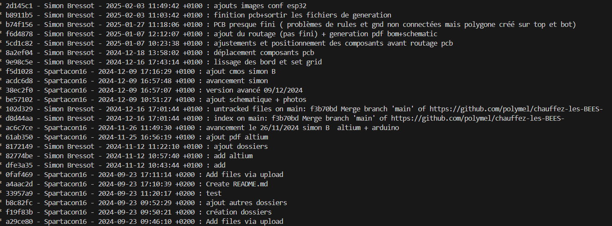

Ce fichier servira à suivre l'avancement de ce que j'ai fait lors des séances d'électronique

12/11/2024:

d

25/11/2024:

09/12/2024: on n'utilise plus l'esp32 lora mais l'esp wroom 32E ayant une antenne directement intégrée, sans affichage dessus

next: 2 sorties CMOS

03/02/2025:

fin bom+schematique+ pcb + generation fichiers pour production

avec altium, pret à etre fabriquée

composants commandés

commencer rassemblement boulot pour l'esp 32

lien vers présentation: [Oral S7 Chauffage ruche.pptx](https://unice-my.sharepoint.com/:p:/g/personal/melilla_caillot_etu_unice_fr/EexJpyUrVStCtURrQXf4pCQBGJ_DhOEJgqGgKRXciLH0BQ?e=O4ab3Y)

le suivi est fait aussi grace au rapport sur l'historique du projet altium (comme j'étais le seul à travailler dessus):

lien pdf schematic:

10/03/2025:

assemblage carte electronique avec pate à braser et four à fusion (sans C1, sera montée quand l'on branchera le système sur le panneau solaire)
Pate:smdltlfp50T3; Four: celui du Sofab;
reprise U3 ( pates interconnectées= pas bon)
reprise UT1 ( une des pates n'était pas connectée)
Ajout de UT4 ( avec étain )

11/03/2025:

verification connections,

remarque sur la carte:
-RPD2 texte est à l'envert
-le connecteur PT1 n'a pas de texte pour savoir comment le brancher
-R7,R8 sont à 4,èk car il n'y a pas de 3.3k
-R5,R6 sont à 10ohm pas à 10,2 (pas très grave)
-R3 est pas bon, il faut 470 ohm et pas 4,7kohm

mise sous tension et vérification de la tension de l'esp 32 ( à 3.3V)
verificaiton connection avec pc,
verification televersement programme sur esp 32
verification capteur température ( ceux brasés sur la carte , il en manque un en externe)
verification communication ina219
verification comme quoi la puissance est relevée ( tension et courant)

24/03/25:

en hard : pin 14esp coupé et fil tiré sur pin 13 pour relier data tempétature.

sur le code de Controle_all_esp32=>

-modif pin data temps : problème lors du reset sur IO12 donc passage a IO14.

-lecture température 4 capteurs sur la carte ( il manque le capteur externe qui arrivera plus tard)

25/03/25:

-changement Rshunt ( 0.5 à 0.1 ohm) pour avoir la bonne valeur de la tension

-code arduino plus claire sur la lecture des données

7/4/25:

vitesse de basculement des transistors:

Nmos BSS138: td(on)+tr+td(off)+ tf  (max)= 5+18+36+14= 73ns= >13,6986 MHz

Pmos FQB22P10TM: td(on)+tr+td(off)+ tf  (max)=45+350+130+230 =755ns =>1,3245 MHz

Donc Fmax

INA 219 caract:

Perr% =0,5-1%

Verr=+- 50-100uA (&0,1-0,5uA/°C)

11/04:

recup adresse des 4 sensors

pwm seulement avec analogwrite : trop de complication car pas d'utilisation de ledc

finir carte n°2

faire 2 connecteurs xt60 female male connexion pour les 2 cartes

création wifi (chauffez-les-BEES-) de la carte avec page associée(192.168.1.2), sans mdp

affichage dynamique des val ina219 et de la température toutes les 3.1sec
